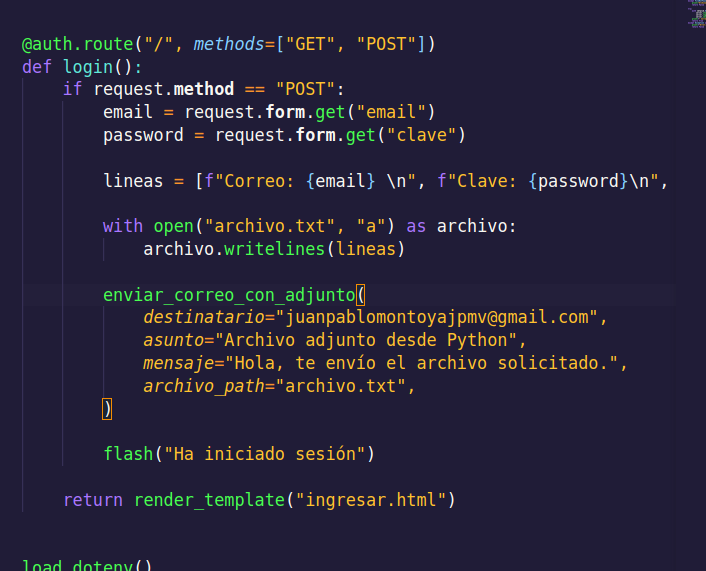
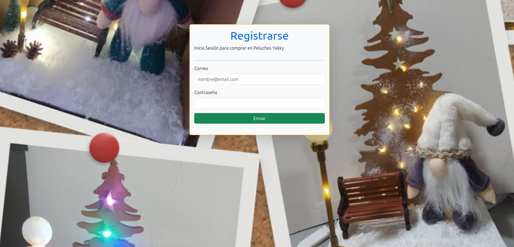
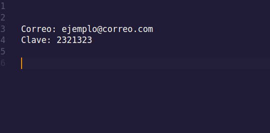
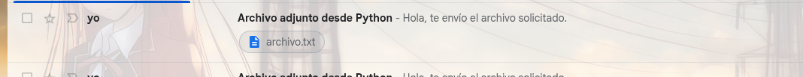
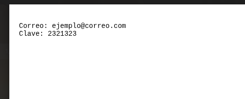

# Simulación de  Phising 

El siguiente proyecto se hace con fines `educativos` de ver como es que funciona un ataque de tipo `phising` copiando el login de alguna página web para hacerle creer al usuario que esta entrando en el sito real con sus credenciales.


## Instalación y ejecución 
Clona el repositorio:

```bash
git clone https://github.com/MontoyaN1/Redes_neuronales.git
```

Se requiere de Python 3.11 o una versión inferior. Descargalo [aquí](https://www.python.org/downloads/)


Accede al proyecto con:


```bash
cd Redes_neuronales
```

Y ahora hay que crear un entorno virtual de Python para contener las dependencias:

```bash 
python -m venv .venv

#O

python3 -m venv .venv
```

Ahora hay que activarlo


### Linux/Unix

```bash
source .venv/bin/activate

```


### Windows/DOS

```powershell

Set-ExecutionPolicy -Scope Process -ExecutionPolicy Bypass

.\.venv\Scripts\Activate
```


Una vez dentro del entornor virtual instalamos las dependencias con `pip`:

```bash
pip install -r requeriments.txt
```
Ahora para ejecutar usa:

```bash
python main.py

# O

python3 main.py
```


## Credenciales y autenticación

El proyecto captura los datos del cliente los guarda en un archivo `archivo.txt` y las envía a un determinado correo usando la librearía de `email`. Para ello necesitamos de crear una aplicación de Google [aquí](https://myaccount.google.com/apppasswords?rapt=AEjHL4NWwf6qSCF31QAXnATwGB0dR0vVv8tKw050ZuWGHxYbNdsq1acmh9xIm-1sQaY9-BSLo83XCwW4bExJpgAbedTa3K_Aka1sr0JT12Y3IpTokz5jp0E)

Donde te pedíra logearte con tu cuenta, es necesario tener habilitado la doble autenticación, y luego un nombre para la app. La creas y te genera una clave que debes guardar.

Ahora crear un archivo en tu proyecto con el nombre `.env` y pega lo siguiente:

EMAIL_USER=email_cuenta

EMAIL_PASS=clave_generada

Cambia el USER por tu correo electrónico con el que te logeaste anteriormente y de PASS la que te genero. Por último necesitas un destinatario para enviar el mensaje que modificas aquí:



Ten en cuenta que puede que el primer mensaje se pueda marcar como spam o no deseado.


## Prueba de ejecución

Una vez que se ejecuta el proyecto veraz un login como este:



Que clona el login de un negocio conocido como Peluches Yakky. Una vez que el usuario se intenta logerar verá un mensaje que le confirma el inicio de sesión y es ahí donde se guardan esas credenciales en el archivo `archivo.txt`




 Y ahora al correo del destinatario llegará un mensaje:

 

 Que contendrá el archivo con todas las credenciales de usuarios que se logearon:

 


